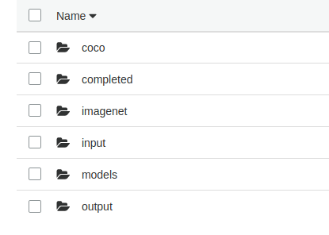
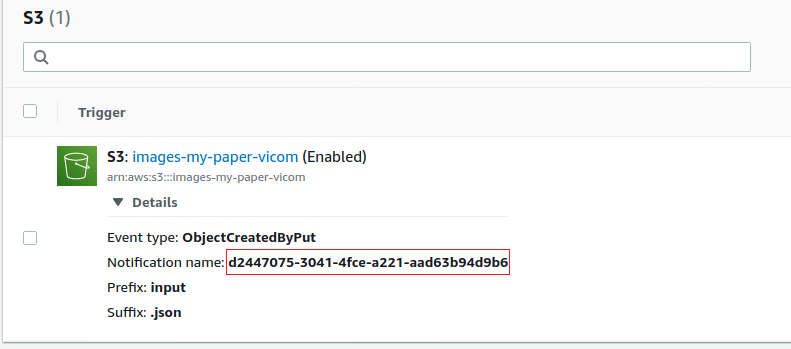

# Benchmarking DNN inference performance on serverless environment with MLPerf (example source code)
-------------------------------------------------------------------------------
## Index:
- [Introduction](#introduction)
- [Installing MLPerf serverless platform](#installing-mlperf-serverless-platform)
- [Benchmarking DNN models in MLPerf](#benchmarking-dnn-models-in-mlperf)
- [Visualizing the experiments](#visualizing-the-experiments)
- [SUT Layers (IE, HANDLER)](#sut-layers)
- [SUT Lambda function ](#sut-aws-lambda-function)
- [Useful information](#useful-information)

## Introduction
This repo is the implementation of the *Benchmarking DNN inference performance on serverless environment with MLPerf*  paper deployed to [AWS Lambda](https://aws.amazon.com/es/lambda/). This repo benchmarks DNN models performance with [Caffe, TensorFlow and OpenVINO models](https://github.com/Vicomtech/serverless-mlperf/tree/master/models), using [OpenCV](https://github.com/opencv/opencv) and [OpenVINO](https://github.com/openvinotoolkit/openvino) as inference engines. The benchmark follows the [MLPerf](https://mlperf.org/) closed division metrics and rules for image classification and object detection computer vision tasks using MobileNetV1 and SSDMobileNetV1 models. It has the following prerequisites:

- OpenCV with OpenVINO as dependency. A precompiled version in Python 3.6 for Amazon Linux (the OS used in [Amazon Lambda runtimes](https://docs.aws.amazon.com/lambda/latest/dg/lambda-runtimes.html)) is available [here](https://github.com/Vicomtech/serverless-mlperf/blob/master/aws_layers/cv2-layer.zip).
- [AWS account](https://aws.amazon.com/)
- [AWS cli command line.](https://docs.aws.amazon.com/cli/latest/userguide/cli-chap-install.html)
- [AWS boto3 library](https://pypi.org/project/boto3/)

## Installing MLPerf serverless platform
### Installing SUT
The MLPerf SUT is comprised of AWS Lambda function ([lambda_test_SUT](https://github.com/Vicomtech/serverless-mlperf/tree/master/lambda_function)) and two layers ([IE](https://github.com/Vicomtech/serverless-mlperf/blob/master/aws_layers/cv2-layer.zip) and [Handler](https://github.com/Vicomtech/serverless-mlperf/blob/master/aws_layers/handler_utils.zip)).
#### 1 Create Lambda function:
- 1.1. Follow the instructions of the AWS  Lambda [documentation](https://aws.amazon.com/lambda/getting-started/?nc1=h_ls).
- 1.2. Paste the code of *lambda_function/lambda_test_SUT.py* into your Lambda function.

#### 2 create IAM Role to enable the Lambda function execution with Amazon S3:
- Go to the [IAM manager](https://console.aws.amazon.com/iam/home)
- create a role choosing the lambda use case


- Attach S3 full access policy: 

- Define rolename:
for example: 


Attach this role to the lambda function in lambda_console_manager/permissions/execution_role.


#### 2 Upload AWS Layers
In the [aws_layer](./aws_layers) folder there two layers (IE layer, Handler layer):
 - **IE Layer:** a precompiled version of IE layer (cv2-layer.zip) is available [here](aws_layers/cv2-layer.zip). 
 - **Handler layer:** use *generate_layer.py* python script to generate a **handler_utils.zip**.
   
 Upload them (cv2-layer.zip, handler_utils.zip) as AWS Lambda layers using the Lambda function web interface. 
 
 The runtime environment in the Amazon layer creation must be **Python 3.6**.

**Important:** If you are willing to upload a modified version of the layers, the zip file folder structure must follow this path: *python/lib/python3.6/site-packages/the_package_name*

- For IE layer **cv2**. 
- For Handler layer **dldt_tools**. 

For more information about AWS Lambda layers check the [following link ](https://medium.com/appgambit/part-1-getting-started-with-aws-lambda-layers-1677a6b006).

#### 3 Configure the Online Storage Service (S3)
- 3.1 Create a bucket in your [S3 storage service](https://aws.amazon.com/es/s3/).
- 3.2 Then, create the following folder structure.



Folder descriptions:
  - **coco:** it will contain the dataset for the object detection task.
  - **imagenet:** it will contain the dataset for the image the classification task.
  - **completed:** the SUT moves here the input .json files from the input folder, when the inference is done.
  - **input:** LoadGen uploads the input .json files from your PC (the event notification must be assigned to this folder, check [section 5](#5-define-event-driven-listener-to-activate-the-sut)).
  - **models:** the DNN models are placed here.
  - **output:** the SUT delivers the output .json files here.
  
#### 4 Define Lambda environment variables:
Add the following environment variables in the AWS Lambda control panel:


The bucket name should match with the previously created in 3.1
#### 5 Define event driven listener to activate the SUT:  
- 5.1 Create a PUT notification in S3 for the **input** folder in your AWS S3 **bucket properties**:

Example:


- 5.2 **Create a S3 event** in the Lambda control panel, with the associated code of the s3 trigger. Example:

- 5.3 **Add a s3 trigger in your bucket** with the event type ObjectCreatedByPut with the associated notification name in 5.1.

Example:



#### 6 Upload the models:
If the folder structure of **3.2** section is created, upload the DNN models to your Amazon S3 bucket to the following path:

```python
s3://your_bucket/models/mobilenetv1/FP32/
s3://your_bucket/models/ssd-mobilenetv1/FP32/
```
The models used for benchmark are:

| Model Name | Vision Task | Engine & Model Type  | Download |
|---|---|---|---|
|  MobileNetV1 | image classification  | IE-IR  | [weights](https://github.com/Vicomtech/serverless-mlperf/blob/master/models/mobilenet_v1_224_frozen.bin), [model](./models/mobilenet_v1_224_frozen.xml) |
| MobileNetV1  |  image classification | OCV-CF  | [weights](./models/mobilenet_v1_224_frozen.caffemodel), [model](./models/mobilenet_v1_224_frozen.prototxt)  |
|  MobileNetV1  | image classification  | OCV-TF  |  [weights & model](./models/mobilenet_v1_224_frozen.pb) |
|  SSDMobileNetV1  | object detection  | IE-IR   |  [weights](https://github.com/Vicomtech/serverless-mlperf/blob/master/models/mobilenet_V1_coco.bin), [model](./models/mobilenet_V1_coco.xml) |
|  SSDMobileNetV1  | object detection  | OCV-CF |  [weights](https://github.com/Vicomtech/serverless-mlperf/blob/master/models/mobilenet-ssd.caffemodel) [model](./models/mobilenet-ssd.prototxt) |
|  SSDMobileNetV1  | object detection  | OCV-TF |  [weights](https://github.com/Vicomtech/serverless-mlperf/blob/master/models/ssdmobilenet_V1_coco.pb), [model](./models/ssdmobilenet_V1_coco.pbtxt) |

Notice that the filenames of the DNN models must follow the naming convention.

The reference TensorFlow models are taken from [MLPerf v0.5 version](https://github.com/mlperf/inference/tree/master/v0.5/classification_and_detection):
- TF MobileNetV1: [mobilenet-v1](https://zenodo.org/record/2269307/files/mobilenet_v1_1.0_224.tgz)
- SSD MobileNetV1: [ssd-mobilenet 300x300](http://download.tensorflow.org/models/object_detection/ssd_mobilenet_v1_coco_2018_01_28.tar.gz)

We used [OpenVINO model optimizer](https://github.com/openvinotoolkit/openvino) to export models to OpenVINO.

#### 7. Upload the dataset images.
7.1 Upload the images to Amazon S3 using aws-cli (recommended) or s3 web interface to **s3://your_bucket/coco** for object_detection and to **s3://your_bucket/imagenet** for image classification.

For more information about datasets and how to download dataset files, go to [MLPerf v0.5 page](https://github.com/mlperf/inference/tree/master/vision/classification_and_detection).

For more information about how to upload severals files through Amazon S3 and aws-cli check the following [link](https://docs.aws.amazon.com/cli/latest/userguide/cli-services-s3-commands.html)
### Configure LoadGen:
The LoadGen is stored in a host machine to send the queries to the SUT. Execute
[*experiments/src/generate_loadgen_input.py*](src/generate_loadgen_input.py) to generate input.json files to be ready for executing the benchmark.
**Important:** the *generate_loadgen_input.py* requires that the downloaded image dataset and the uploaded image dataset to S3  be the same as ix explained in step 7.1.
usage:
```python
python3 generate_loadgen_input.py \
  --num number_of_image_samples --input_dataset <local path of the images of the dataset> \
   --dataset_name coco
```
Options:
 - --num: number of image samples for the experiments.
 - --input_dataset: the collection of the images downloaded from the selected dataset [COCO, ImageNet], check 7.1 section for more information.
 - --dataset_name: the dataset name, accepted values [coco, imagenet]

For example, if --num 1000 , a thousand .json files will be created for each experiment.
The output .json files should look like this format.
```python
{"CompletedPath": "completed/ssd_tf", "ImageFilenames": ["COCO/000000578093.jpg"], "OutputPath": "output/ssd_tf"}
```

## Benchmarking DNN models in MLPerf
The **experiments/src/MLPERF.py** python script manages the all life-cycle of the benchmark, which finally shows the benchmarked DNN model performance results.

MLPerf.py output result sample:

```python
**********benchmarked unit***********
benchmark ssd_openvino
memory 768
latencyes 50% -> 291.14699363708496 90% -> 316.87426567077637
QPS: 47.511881528529536
number of files: 1001
Time difference 21.068414211273193 s
```
### Configure the benchmark type
Go to the created Lambda function and modify the *cv_task* and *engine_and_model* variable in the Lambda function. The *cv_task* allows *classification* and *object_detection* configurations and the *engine_and_model* options are *ie-ir*, *ocv-cf*, *ocv-tf* (see the paper for details).

 Example.
```python
engine_and_format = "ie-ir" # ie-ir, ocv-cf, ocv-tf
cv_task = "classification" # classification, object_detection
backend = choose_engine_and_format(engine_and_format, cv_task)
```
Also, modify the Lambda memory configuration for the desired memory configuration for each function instance.
In the article 4 memory slots are defined [768, 1536, 2240, 3008]
Example:

### Start benchmarking
```python
python MLPERF.py --engine_and_format ie-ir --cv_task classification --memory_type 0 --bucket_name your_bucket_name --profile=your_profile
```
Options:
- --engine_and_format: [ie-ir, ocv-cf, ocv-tf]
- --cv_task: [classification, object_detection]
- --memory_type: [0,1,2,3] -> for [768,1536,2240,3008] MB
- --bucket_name: the user created bucket name in AWS S3.
- --profile: the created profile name with secret id and keys for aws-cli operations.

If a profile is not defined in aws-cli, use *--profile=default* in the command line.
### Understanding the benchmarked results
While the benchmarking process is working in amazon AWS Lambda, each function instance delivers a **.json** file with the performance metrics in the s3://your_bucket/output with the benchmarked metrics.
The json structure of these files are:
```python
{
  "ImageFilenames": [
    "Imagenet/val/ILSVRC2012_val_00003351.JPEG"
  ],
  "inf_perf": [
    {
      "load_model": 72.51644134521484,
      "image_operations": 34.81721878051758,
      "forward": 1137.1262073516846
    }
  ],
  "result": [], # we skip this because the vector is too big (of size [1,1,100,7])
  "start_time": 1590342810.3134592,
  "finish_time": 1590342811.5321517
}
```
So if you upload 1000 .json to S3 folder, 1000 .json results will be stored.
When the benchmark is finished all measured metric files are downloaded and the benchmark is calculated.
The MLPERF.py python script calculates the benchmark from the S3 stored .json files, as it is explained in the section ENABLING SERVERLESS RUNTIME IN MLPERF. 

## Visualizing the experiments
*experiments/src/Latencies_barchart.py* and *experiments/src/qps_barchart.py* generate the barchart images taking *results.csv* file as input data.

## SUT Layers
As it is explained in the paper there are two AWS layer in the implementation. This diagram shows a detailed overview of the layers:


## SUT AWS Lambda function: 
This Lambda function depends on two AWS layers **IE layers (cv2.zip)** and **handler_utils (handler_utils.zip)** processing_layer. A Lambda function has two scopes, global and function scope, for example:
```python
  import xxxx
  GLOBAL_SCOPE
  def lambda_handler(event, context):
    FUNCTION SCOPE.
```
The interesting part of GLOBAL_SCOPE is that all instances created in this scope, are shared between function instances (FUNCTION_SCOPE).

In the Lambda function there is a function called choose_engine_and_format() which defines the vision task type along with the inference engine and DNN model format. It loads the DNN model, initializes the dataset (ImageNet, COCO) and prepares the inference engine into the GLOBAL SCOPE.  
```python
def choose_engine_and_format(engine_and_format, cv_task):
    if cv_task == "classification":
        models_path = "mobilenetv1/FP32/"
        if engine_and_format == "ie-ir":
            backend = "mobilenet-ov-runtime"
        elif engine_and_format == "ocv-tf":
            backend = "mobilenet-tf-runtime"
        elif engine_and_format == "ocv-cf":
            backend = "mobilenet-caffe-runtime"
    if cv_task == "object_detection":
        models_path = "ssd-mobilenetv1/FP32/"
        if engine_and_format == "ie-ir":
            backend = "ssd-mobilenet-ov-runtime"
        elif engine_and_format == "ocv-tf":
            backend = "ssd-mobilenet-tf-runtime"
        elif engine_and_format == "ocv-cf":
            backend = "ssd-mobilenet-caffe-runtime"
    backend_handler = HandlerApp(engine_and_format)
    backend_handler.init(backend, models_path, make_profiling = True)
    return backend_handler
```
The Handler layer is imported in the Lambda function as this way:

```python
from dldt_tools.processing_layer import HandlerApp #for Handler layer
```

And the handler layer is initialized with this code lines: 
 ```python
     backend_handler = HandlerApp(engine_and_format)
    backend_handler.init(backend, models_path, make_profiling = True)
 ```    
The DNN inference is processed with the following functions: 
 ```python
    h_var = backend.init_handler_variables(event) #initialize the input data from Dataset stored in OSS
    backend.make_aws_inference(h_var) # make aws inference and post-processing
    finish_time = time.time()
    h_var["OutputData"]["start_time"] = init_time
    h_var["OutputData"]["finish_time"] = finish_time
    backend.deliver_output_data(h_var) #deliver the benchmarking metrics in the OSS with a .json file
  ``` 
## USEFUL INFORMATION:
  - [Getting started with Amazon Lambda](https://aws.amazon.com/lambda/getting-started/?nc1=h_ls)
  - [Amazon S3](https://aws.amazon.com/s3/getting-started/)
  - [Define IAM roles for S3](https://docs.aws.amazon.com/neptune/latest/userguide/bulk-load-tutorial-IAM.html)
  - [Getting started with Amazon Lambda layers](https://medium.com/appgambit/part-1-getting-started-with-aws-lambda-layers-1677a6b006)
